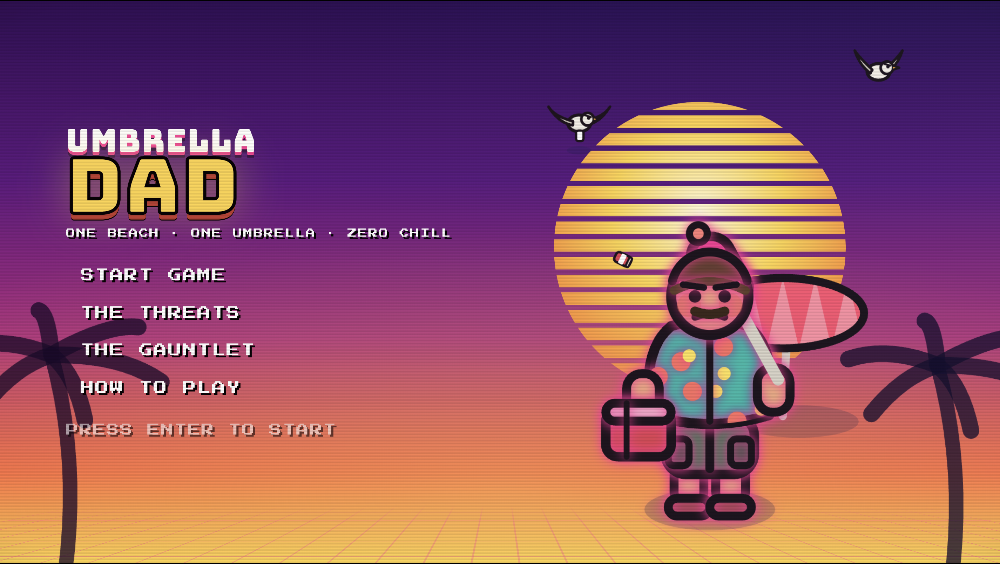
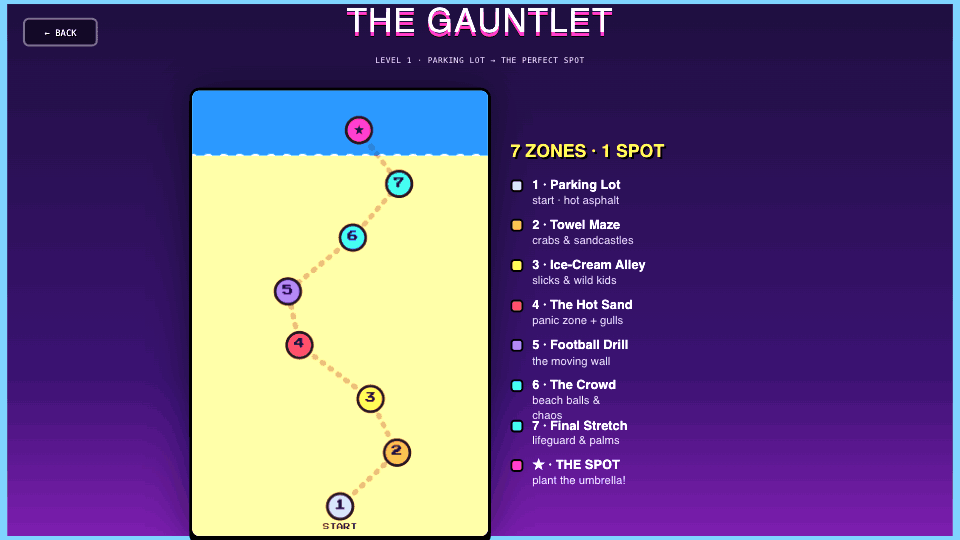
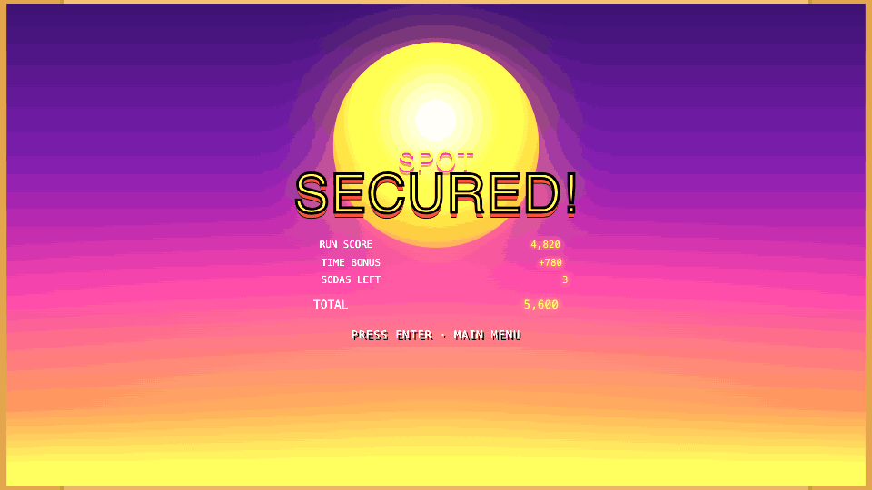

# ⛱️ Umbrella Dad

> **One beach. One umbrella. Zero chill.**
>
> The kids are feral. The seagulls are organized. The sand is *lava.* And one
> sunburned, flip-flopped dad just wants to plant his umbrella in the perfect
> spot before he loses his last shred of patience. Swing it, throw sodas at the
> sky-rats, and bulldoze through a junior football drill — because that beach
> chair isn't going to relax in itself. **Get to THE SPOT. Defend the dream.**

A comedic arcade survival game. A tired suburban dad must cross one chaotic
beach — kids, crabs, seagulls, melting ice cream, scorching sand and a junior
football drill — to plant his umbrella at **THE SPOT** near the ocean. Built as
a self-contained HTML5 canvas game with chunky flat-vector cartoon art, a modern
16-bit / synthwave look, CRT warmth, and lots of juice.



| The Gauntlet | Spot Secured |
| --- | --- |
|  |  |

## Play it

It's pure static files — no build step. Serve the folder and open it:

```bash
python3 -m http.server 8000
# then open http://localhost:8000
```

(Opening `index.html` directly via `file://` also works in most browsers; a
local server is just more reliable for audio + fonts.)

There's also a standalone **character animation sheet** at `Dad Sprite Sheet.html`
(linked from the main menu via *↗ ANIMATION SHEET*): six articulated-rig
animations with live previews, numbered frame strips, and PNG export.

## Controls

| Key | Action |
| --- | --- |
| **WASD / Arrows** | Jog toward the ocean (slightly clumsy; hot sand & ice change the feel) |
| **J / Space** | Umbrella swing — wide cone melee with knockback |
| **K** | Throw a soda — arced ranged stun (only **6**; grab coolers to refill) |
| **P / Esc** | Pause |
| **M** | Mute / unmute |
| **Enter** | Start / restart / confirm |

## The gauntlet

Reach the spot before the **DAD STRESS** meter fills. Score by whacking and
stunning threats, dodging, chaining combos, and finishing fast.

- **Beach Kids** — chaotic wanderers, bounce dad backward
- **Sand Crabs** — sideways scuttlers that pinch
- **Seagulls** — dive-bomb and steal a soda from the cooler
- **Ice-Cream Slicks** — lose all traction and slide
- **Hot Sand** — uncontrollable panic hops + overheat
- **Junior Football Drill** — a coached, formation-marching moving wall
- **Beach Balls** — bouncing drifters in the crowd

## Architecture

Plain modular vanilla JS — beginner-friendly, no framework, no bundler. Each
file owns one concern (loaded in order from `index.html`):

| File | Role |
| --- | --- |
| `game/util.js` | Shared math / collision / color helpers, world constants |
| `game/palette.js` | Color presets + fonts + live re-skin (`applyTweaks`) |
| `game/audio.js` | **AudioManager** — WebAudio-synthesized placeholder SFX + beach ambience |
| `game/art.js` | The dad: chunky flat-vector drawing + umbrella swing |
| `game/art2.js` | Enemy + decor sprites + soda projectile |
| `game/fx.js` | Particles (fizz, sand, stars, confetti, rings) + score popups |
| `game/dad.js` | **PlayerController** — movement feel, states, swing/throw, score/combo |
| `game/enemies.js` | **ObstacleManager** — kid / crab / gull / ball / footballer / coach AI |
| `game/level.js` | Level layout + spawner, hazards, coolers, ocean, the goal |
| `game/hud.js` | **UIManager** — HUD meters, threats gallery, gauntlet map, win/lose stats |
| `game/game.js` | Engine: state machine, loop, camera, input, **WeaponSystem** wiring, menu key-art |
| `game/sprites.js` | Articulated dad rig (posed joints + IK arms) — used by the animation sheet |
| `game/spritesheet.js` | Builds the `Dad Sprite Sheet.html` page: previews, frame strips, PNG export |

> **Two dads, on purpose.** The in-game dad is the fast procedural figure in
> `art.js`. The newer articulated rig in `sprites.js` is a higher-fidelity motion
> reference shown on the animation sheet; their state/animation names already
> match (`jog`/`swing`/`throw`/`slip`/`hop`/`victory`), so unifying them is a
> clean future step. See `handoff/` (`ARCHITECTURE`, `GAMEPLAY`, `SPRITE-RIG`,
> `ROADMAP`) and `CLAUDE.md` for the full developer notes.

### Live re-skin

`index.html` defines `window.__UD_TWEAKS` (palette / font / logo treatment /
dad build / CRT). The engine reads it on boot via `UD.applyTweaks()`. Edit those
values to change the look — e.g. `palette: "night"` or `dadBuild: "dadbod"`.

## Audio

All sound is generated procedurally at runtime via the WebAudio API (no asset
files), so the placeholder cues — dad grunts, seagull screams, soda fizz, coach
whistle, panic hops, win fanfare, looping surf ambience — ship in-code. Replace
the `case` blocks in `game/audio.js` with real samples to upgrade.

## Credit

Gameplay, art direction and visual system designed in Claude Design; implemented
here as a runnable game.
